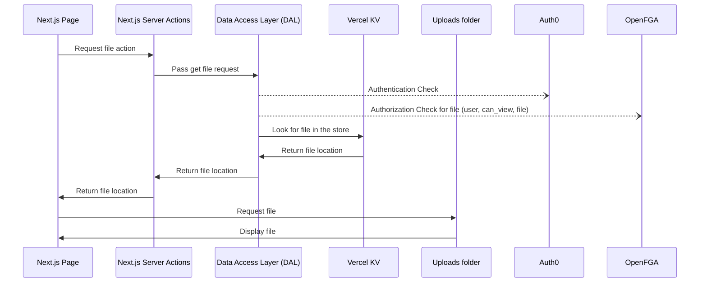
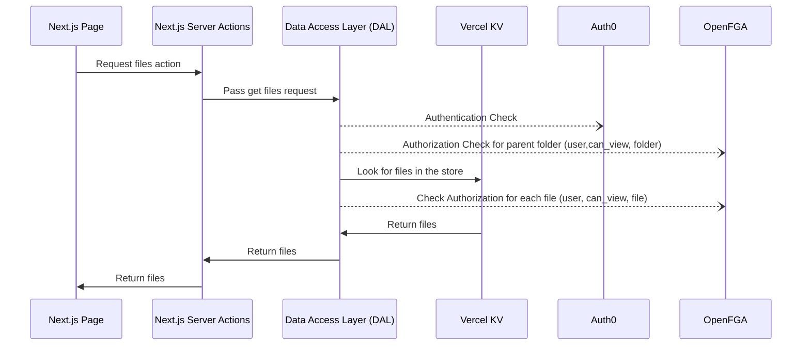
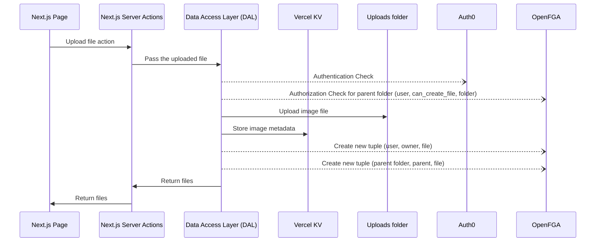
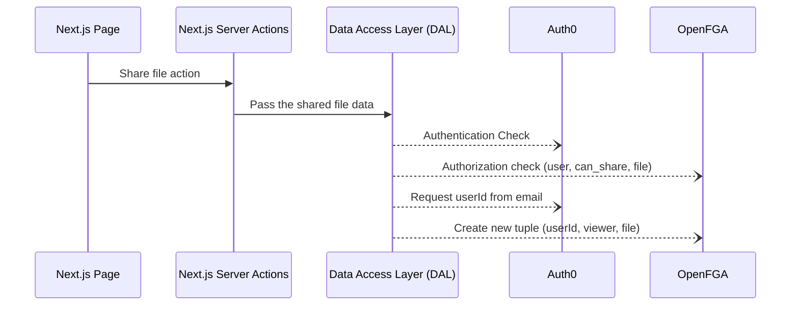
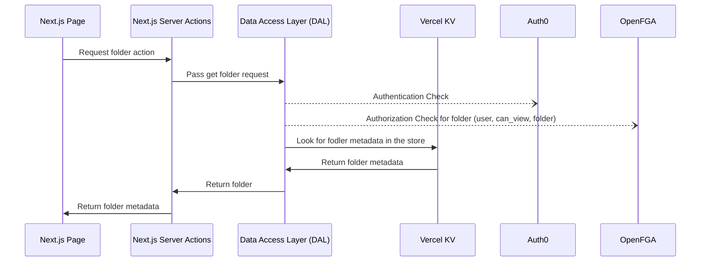
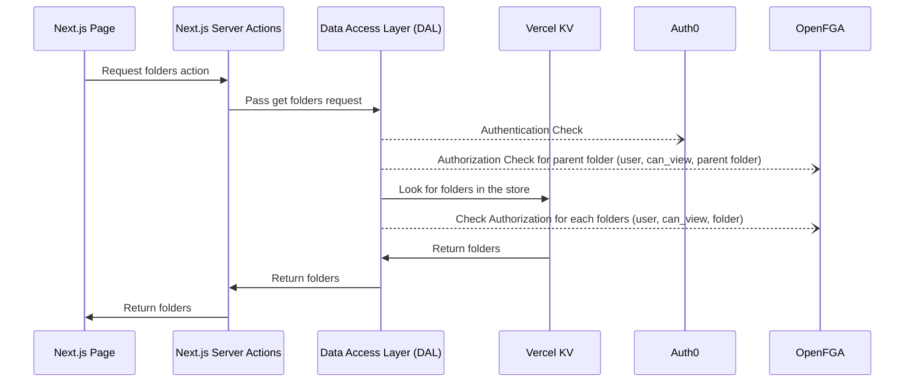
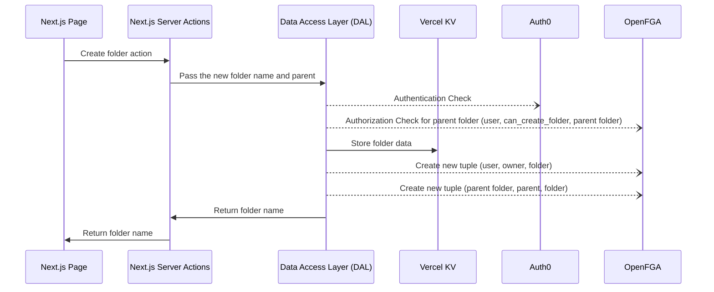
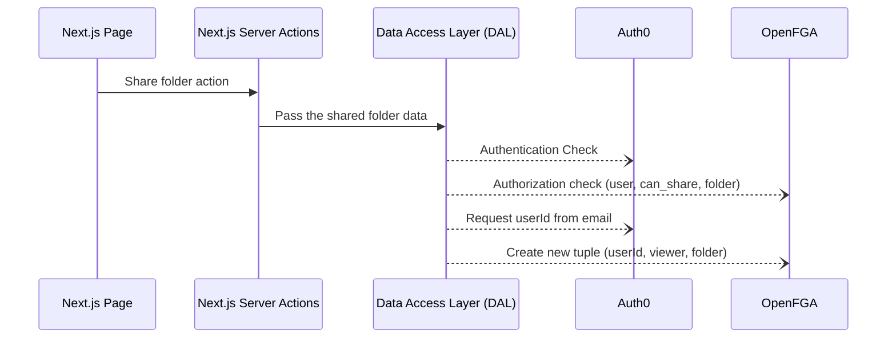

# Google Drive-style application with FGA

This is a simplified Google Drive-style application to demonstrate how to use [OpenFGA](https://openfga.dev) or [Okta FGA](https://fga.dev) to handle Fine Grained Authorization (FGA) on a per-resource level.

A user can log in, add files (pictures only), and create folders. Uploaded files are only visible to them by defaullt. They can choose to either share a file directly with other users or share folders (or subfolders), and all files contained within them will be shared automatically. Files can be shared with other users available in the Auth0 tenant; the application will look for them based on their email address.

This demo uses both Auth0 ([create a free account here](https://auth0.com)), and either [OpenFGA](https://openfga.dev) or its hosted and managed version [Okta FGA](https://fga.dev).

> [!NOTE]
> If you prefer using a [OpenFGA](https://openfga.dev), switch to the branch `feature/openfga`

The data is stored in a [Vercel KV store](https://vercel.com/docs/storage/vercel-kv).

> [!NOTE]
> If you prefer using a PostgreSQL Database, switch to the branch `feature/postgress`


## 1. Getting Started

Copy the `.env.sample` file to `.env.local`, and fill in the missing environment variables:

```bash
cp .env.sample .env.local
```

Install the npm dependencies:

```bash
npm install
```

Run the development server:

```bash
npm run dev
```

Open [http://localhost:3000](http://localhost:3000) in your browser to see the result.

## 2. Configure Auth0

1. Go to the [Auth0 dashboard](https://manage.auth0.com/) and create a new application of type **Regular Web Application**.
2. Go to the settings page of the application.
3. Configure the following settings:

- **Allowed Callback URLs**: Should be set to `http://localhost:3000/` when testing locally or typically to `https://myapp.com/` when deploying your application.
- **Allowed Logout URLs**: Should be set to `http://localhost:3000/` when testing locally or typically to `https://myapp.com/` when deploying your application.
- **Allowed Web Origins**: Should be set to `http://localhost:3000` when testing locally or typically to `https://myapp.com/` when deploying your application.

4. Save the settings.

### Auth0 environment

```bash
# A long, secret value used to encrypt the session cookie
AUTH0_SECRET='LONG_RANDOM_VALUE'
# The base url of your application
AUTH0_BASE_URL='http://localhost:3000'
# The url of your Auth0 tenant domain
AUTH0_ISSUER_BASE_URL='https://YOUR_AUTH0_DOMAIN.auth0.com'
# Your Auth0 application's Client ID
AUTH0_CLIENT_ID='YOUR_AUTH0_CLIENT_ID'
# Your Auth0 application's Client Secret
AUTH0_CLIENT_SECRET='YOUR_AUTH0_CLIENT_SECRET'
```

You can execute the following command to generate a suitable string for the `AUTH0_SECRET` value:

```javascript
node -e "console.log(crypto.randomBytes(32).toString('hex'))"
```

## 3. OpenFGA or Okta FGA

You have the choice of using either the open-source OpenFGA or the managed Okta FGA authorization engine to make access control descisions. Both use the same SDK, so once set up, your application can connect to either choice.

### OpenFGA

To run your OpenFGA server locally, follow the steps described on [this page](https://openfga.dev/docs/getting-started/setup-openfga/overview).

### Okta FGA

To use Okta FGA, use your Auth0 account to log in to [dashboard.fga.dev](https://dashboard.fga.dev/).

### OpenFGA / Okta FGA environment

```bash
# The url of your OpenFGA / Okta FGA server
FGA_API_URL='https://localhost:8080' or 'https://api.[region].fga.dev'
# The store ID found in your OpenFGA / Okta FGA Dashboard under settings
FGA_STORE_ID=
# The authorization model ID found in your OpenFGA / Okta FGA Dashboard under settings. This model ID changes with each change to the model
FGA_AUTHORIZATION_MODEL_ID=
# The FGA token issuer
FGA_API_TOKEN_ISSUER='http://localhost:8080' or 'fga.us.auth0.com'
# The API audience
FGA_API_AUDIENCE='https://localhost:8080' or 'https://api.[region].fga.dev'
# The client ID found in your OpenFGA / Okta FGA Dashboard under settings
FGA_CLIENT_ID=
# The client secret found in your OpenFGA / Okta FGA Dashboard under settings
FGA_CLIENT_SECRET=
```

### OpenFGA Model

The OpenFGA model used for this application looks similar to the Google Drive example on the [OpenFGA Playground](https://openfga.dev/docs/getting-started/setup-openfga/playground), with some minor tweaks.

The application currently does not implement all functionality, like editing or deleting files and folders. This might be added in the future.

```
model
  schema 1.1

type user

type file
  relations
    define can_delete: owner or owner from parent
    define can_share: owner or owner from parent
    define can_view: viewer or owner or viewer from parent
    define can_write: owner or owner from parent
    define is_owned: owner
    define is_shared: can_view but not owner
    define owner: [user]
    define parent: [folder]
    define viewer: [user, user:*]

type folder
  relations
    define can_create_file: owner or owner from parent
    define can_create_folder: owner or owner from parent
    define can_share: owner or owner from parent
    define can_view: viewer or owner or viewer from parent
    define owner: [user]
    define parent: [folder]
    define viewer: [user, user:*] or owner or viewer from parent
```

### OpenFGA / Okta FGA checks

The application does the following OpenFGA / Okta FGA checks:

#### Files

- Requesting a file:
  - Check if the current user has a `can_view` relationship to a file.
- Requesting all files for a folder:
  - Check if the current user has a `can_view` relationship to a folder.
  - Check for a `can_view` relationship for all files.
- Uploading a file:
  - Check for a `can_create_file` relationship to the parent folder.
  - Once uploaded:
    - Write a tuple setting the user as the `owner` of the new file.
    - Write a tuple setting the parent folder as the `parent` of the new file.
- Sharing a file:
  - Check if the current user has a `can_share` relationship with the file.
  - Write a tuple setting the user we shared the file with as a `viewer` of the file.
- Editing a file:
  - TBD
- Deleting a file:
  - TBD

#### Folders

- Requesting a folder:
  - Check if the current user has a `can_view` relationship to the folder.
- Requesting all folders for a parent folder:
  - Check if the current user has a `can_view` relationship to the parent folder.
  - Check for a `can_view` relationship with all folders withing the parent.
- Creating a new folder:
  - Check if the user has a `can_create_folder` relationship for its parent.
  - Once created:
    - Write a new tuple setting the current user as its `owner`.
    - Write a new tuple setting the parent folders as its `parent`.
- Sharing a folder:
  - Check if the curent user `can_share` the folder.
  - Write a tuple setting the new user as a `viewer`.
- Editing a folder:
  - TBD
- Deleting a folder:
  - TBD

## 4. Configure Vercel KV

Go to the [Vercel dashboard](https://vercel.com/) and create a new KV store.

You can copy the below `.env` variables from the **Getting started** page of your store:

### Vercel KV environment

```bash
KV_URL="redis://****.upstash.io:****"
KV_REST_API_URL="https://****.upstash.io"
KV_REST_API_TOKEN="****"
KV_REST_API_READ_ONLY_TOKEN="****"
```

## 5. Architecture

### Get a file



### Get files for folder



### Upload a file



### Share a file



### Get a folder



### Get folders for folder



### Create a folder



### Share a folder


